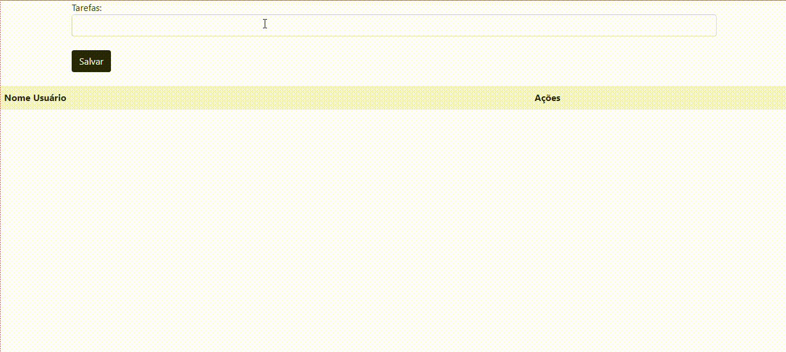
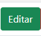

[Projeto - ArrayProject](#projeto---arrayproject)

[Descrição](#descri%C3%A7%C3%A3o)

[Introdução](#introdu%C3%A7%C3%A3o)

[Funcionalidades](#funcionalidades)

[Tecnológias Utilizadas](#tecnol%C3%B3gias-utilizadas)

[Fontes Consultadas](#fontes-consultadas)

[Autores](#autores)

# Projeto - ArrayProject

Projeto de construção de uma lista de tarefas por meio do Array, utilizando linguagem JavaScript, da disciplina de Programação Web I, do professor Leonardo.

Trabalho feito em dupla por: Thalyta das Neves Ferreira & Nicolly da Silva D'Ávila
Ambas do segundo ano A

## Descrição:

    É um site criado para armazenar tarefas do cotidiano, basicamente se comportando como uma lista de tarefas virtual.

## Introdução:

O site intituludado de Instarefas tem o objectivo de armazenar tarefas do dia a dia, como uma lista de tarefas. O site possui 3 funcionabilidades; 'salvar', 'editar' e 'excluir' tarefas.Cuja as descrições estão sendo fornecidas no Indíce de funcionalidades do site.

## Funcionalidades:

- `Salvar`: o botão salvar é utilizado para guardar a tarefa anteriormente digitada.

- `Editar`: o botão editar é utilizado para modificar/editar a tarefa digitada e guardada com o salvar.

- `Excluir`: o botão excluir é utilizado para apagar a a tarefa salvada.

## Tecnológias Utilizadas:

 As tecnólogias utilizadas para a criação foram..
    HTML      
    

    CSS
   

   GitHub

   

   Visual Studio Code

   

   JavaScript

   

## Fontes Consultadas:

[Alura](https://www.alura.com.br/artigos/escrever-bom-readme)- Como escrever um README incrível no seu Github

[lohhans](https://gist.github.com/lohhans/f8da0b147550df3f96914d3797e9fb89) - Um modelo para fazer um bom README

## Autores:

Thalyta das Neves Ferreira & Nicolly da Silva D'Ávila 2A
